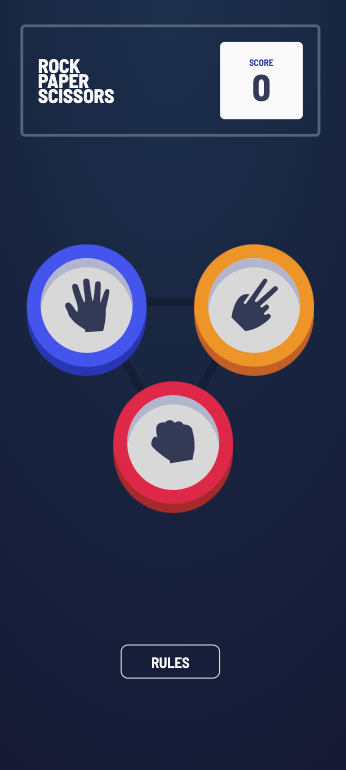
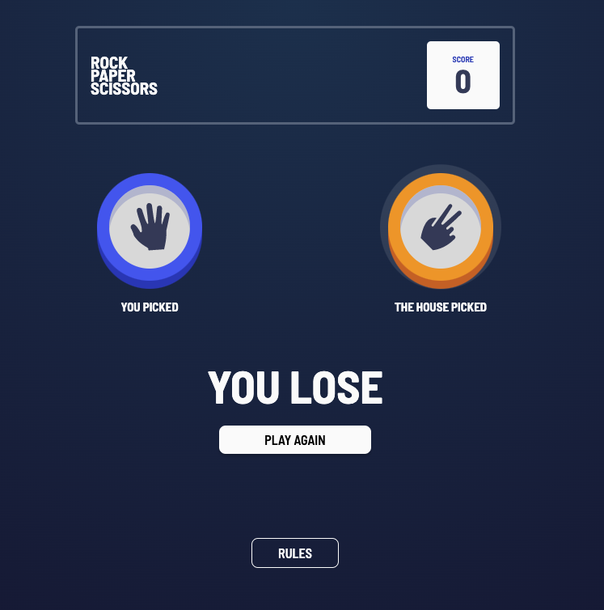
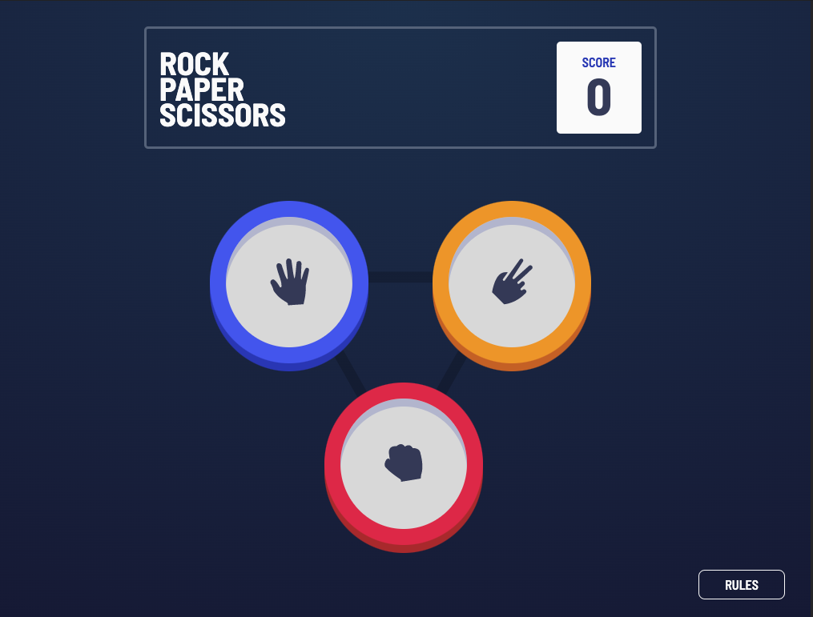

# Frontend Mentor - Rock, Paper, Scissors solution

This is a solution to the [Rock, Paper, Scissors challenge on Frontend Mentor](https://www.frontendmentor.io/challenges/rock-paper-scissors-game-pTgwgvgH). Frontend Mentor challenges help you improve your coding skills by building realistic projects.

## Table of contents

- [Overview](#overview)
  - [The challenge](#the-challenge)
  - [Screenshot](#screenshot)
  - [Links](#links)
- [My process](#my-process)
  - [Built with](#built-with)
  - [What I learned](#what-i-learned)
  - [Continued development](#continued-development)
  - [Useful resources](#useful-resources)
- [Author](#author)
- [Acknowledgments](#acknowledgments)

## Overview

### The challenge

Users should be able to:

- View the optimal layout for the game depending on their device's screen size
- Play Rock, Paper, Scissors against the computer
- Maintain the state of the score after refreshing the browser _(optional)_
- **Bonus**: Play Rock, Paper, Scissors, Lizard, Spock against the computer _(optional)_

### Screenshot





### Links

- Solution URL: [src](https://github.com/btebe/rps-game)
- Live Site URL: [game](https://btebe.github.io/rps-game/)

## My process

### Built with

- Semantic HTML5 markup
- CSS custom properties
- Flexbox
- CSS Grid
- Mobile-first workflow

### What I learned

I learnt how to make 3d buttons with only css by uisng box-shadow. Also, i found :is() to be quite useful to minimize lines in css.

To see how you can add code snippets, see below:

```css
.paper {
  box-shadow: hsla(230, 23%, 78%, 1) 0px 10px inset, hsla(230, 64%, 46%, 1) 0px 5px,
    hsla(230, 64%, 46%, 1) 0px 10px;
}

:is(.paper, .rock, .scissors) {
  height: 203px;
  width: 198px;
  border-width: 20px;
}
```

### Continued development

I would like to further improve my css skills.

### Useful resources

- [Example resource 1](https://getcssscan.com/css-box-shadow-examples) - helped me understand more about box-shadow.
- [Example resource 2](https://www.youtube.com/watch?v=McC4QkCvbaY) - This video inspired me to use the :is() function.

## Author

- Website - [Basma Tebe](https://basma94tebe.wixsite.com/my-site)
- Frontend Mentor - [@btebe]https://www.frontendmentor.io/profile/btebe)

## Acknowledgments

I would like to give my gratitude to Kevin Powell for makeing great content about css on youtube.
